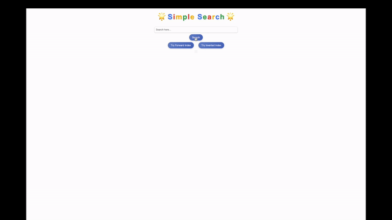
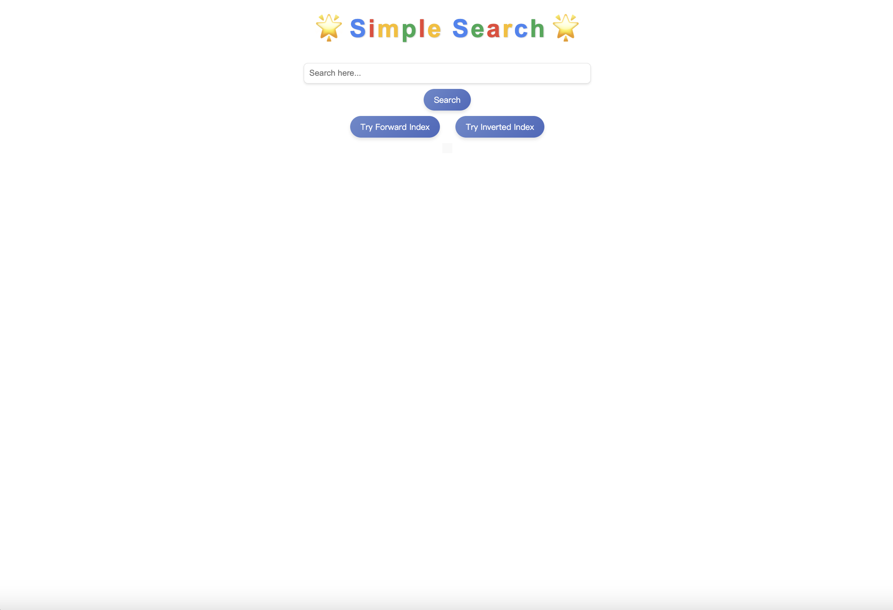
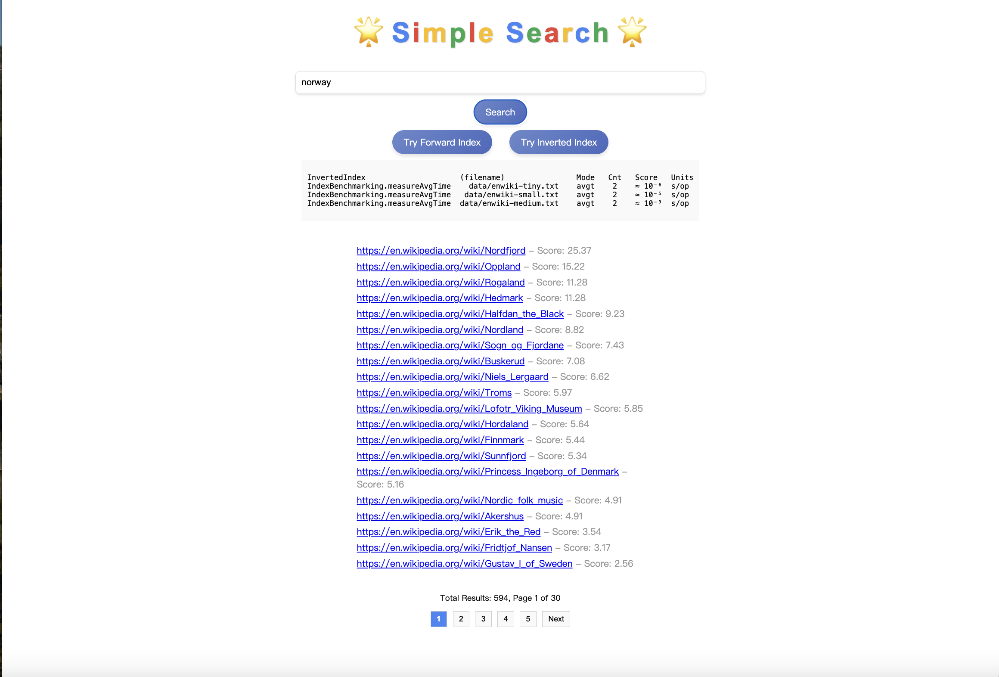
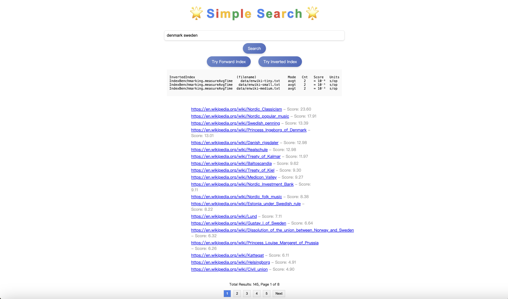
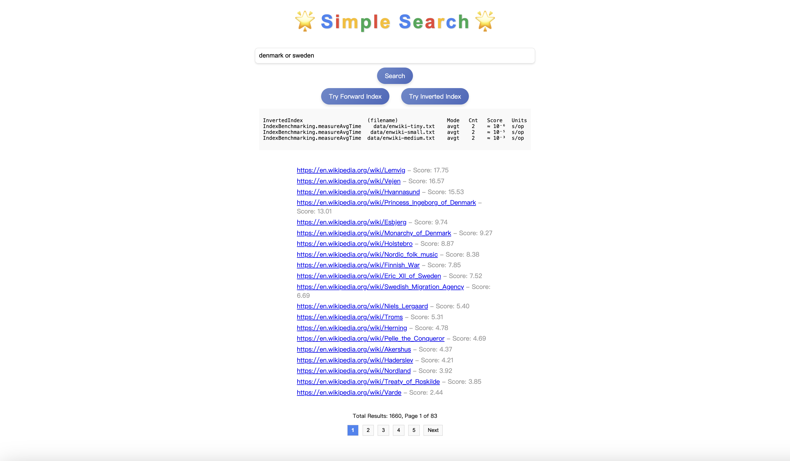

# A simple search engine. 
- It is developed using Java and SQLite

- Database:  
The search data is based on a random dataset extracted from English Wikipedia, specifically the enwiki-medium.txt file (11.6 MB, containing 25,011 websites). I used SQLite to create a database and migrated the content from the text file into the database. The database structure includes the following:
	1.	Webpages Table: Stores information about the webpages, including their content and metadata.  
	2.	ForwardIndex Table: Implements the forward indexing method, mapping webpages to the words they contain and their frequencies. 
	3.	InvertedIndex Table: Implements the inverted indexing method, mapping words to the webpages where they appear. 
To optimize query performance, appropriate indexes have been added to the ForwardIndex and InvertedIndex tables. Due to the large size of the database file, I have not uploaded the .db file.

- In this search engine, you can input any word or sentence, and connect them using “or” or spaces. It will return search results, including the number of results found and the links to each webpage. Clicking on a webpage link will display its specific content. 
 
Next to the webpage links, a score is displayed. This score is calculated using TF-IDF (Term Frequency-Inverse Document Frequency), which combines the frequency of the term within a document (TF) and the term’s uniqueness across the document set (IDF) to evaluate its importance in the document. A lower score may indicate that the term appears less frequently in the document (low TF) or is common across many documents (low IDF).

- Additionally, this webpage offers two different search methods: forward index and inverted index. You can choose between these methods, and the webpage will display their performance on datasets of different sizes. Performance is measured using a benchmark that evaluates the average execution time of the indexing method. The lower the score, the faster the speed.

- The following are detailed screenshots:

    
    
    
    
    
    

